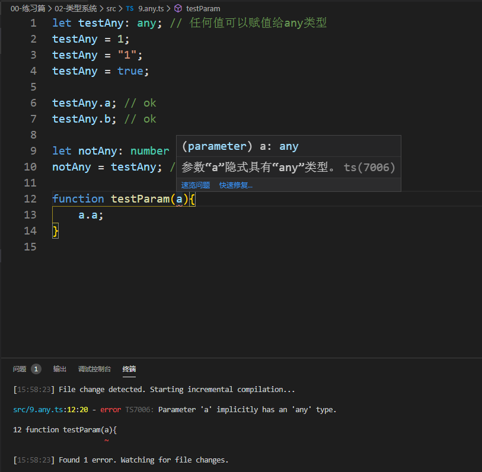

# 其他类型

> 知识大纲

* 无值类型
    * 表示没有任何数据的类型，通常用于标注无返回值函数的返回值类型，函数默认标注为void
        ```ts
        function fn(): void{
            // 没有return或者return undefined
        }
        ```
    * 注意，在strictNullChecks为false的情况下，undefined和null都可以赋值给void，当strictNullChecks为true的时候，只有undefined才可以赋值给void   

* Never类型
    * 当一个函数永远不可能执行return的时候，返回的就是never，与void不同，void是执行了return，只是没有值，never是不会执行return，比如抛出错误，导致函数终止执行
        ```ts
        function fn(): never{
            throw new Error("error");
        }
        ```  

* 任意类型    
    * 有的时候，我们并不确定这个值到底是什么类型或者不需要对该值进行类型检测，就可以标注为any类型
        ```ts
        let a: any;
        ```  
    * 一个变量声明未赋值且未标注类型的情况下，默认为any类型
    * 任何类型值都可以赋值给any类型
    * any类型也可以赋值给任意类型
    * any类型有任意属性和方法
    * 注意 - 标注为any类型，也以为着放弃对该值的类型检测，同时放弃IDE的只能提示 
    * 小技巧 - 当指定noImplicitAny配置为true，当函数参数出现隐含的any类型时报错  

* 未知类型
    * unknown属于安全版的any，但与any不同的是
        * unknown仅能赋值给unknown，any
        * unknown没有任何的属性和方法

* 函数类型                  
    * 在js中函数是非常重要的，在ts也是如此，同样的函数也有自己的类型标注格式
    * 参数，返回值
    * 具体代码
        ```ts
        function add(a: number, b: number): number{
            return a + b;
        }
        ```


> 练习

* 先试试void类型，因为我们的strictNullChecks为true，所以如果我们`return null`，那这里就会报错
    ```ts
    function fn(): void{

    }
    let v = fn();    
    ```
* never类型 - 抛出错误，函数终止或者死循环什么的，这里就不演示了
* any类型 
    ```ts
    let testAny: any; // 任何值可以赋值给any类型
    testAny = 1;
    testAny = "1";
    testAny = true;

    testAny.a; // ok
    testAny.b; // ok

    let notAny: number = 10;
    notAny = testAny; //不会报错

    function testParam(a){
        a.a;
    }    
    ```
* 上述代码中，testParam函数的参数a是个any类型，但编辑器也没有报错，这时候我们可以设置noImplicitAny为true，然后就能看到

    

* unknown类型
    ```ts
    let notSure: unknown;

    // notSure.xyz; //报错，如果是any也不会报错

    let numTest: number = 10;
    // numTest = notSure; //这里就会报错，如果是any就不会报错

    numTest.toFixed(2); //如果使用any，然后给any赋值个字符串，就会有问题，因为any可以赋值给numTest    
    ```  

* 函数类型
    * 随意写个函数，比如就拼接字符串，返回的是拼接第一个字符串第一个字符和第二个字符串最后个字符  
        ```ts
        function getStr(a: string, b: string): string{
            return a.substring(0, 1) + b.substring(b.length - 1, b.length);
        } 

        console.log(getStr("123456", "789"));        
        ```   

> 目录

* [返回目录](../../README.md)