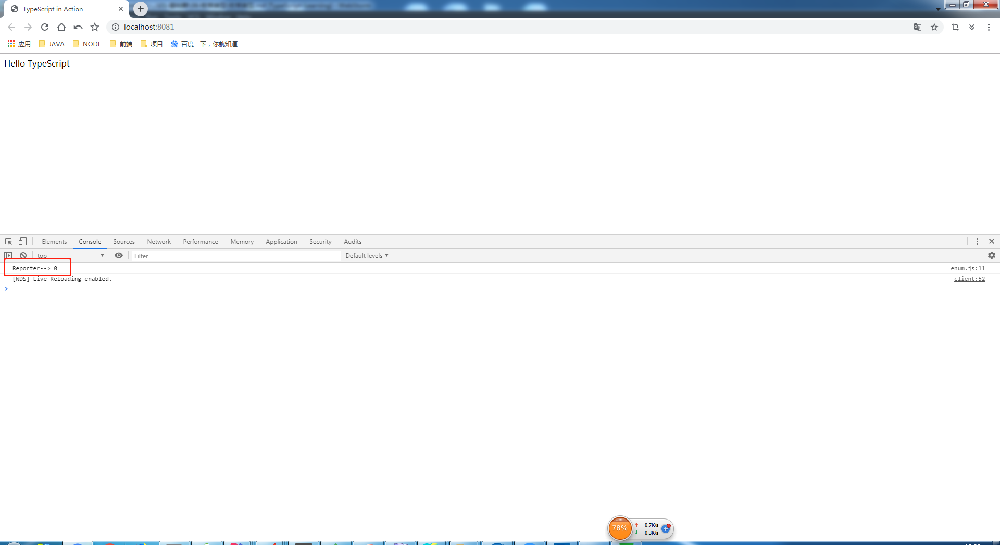
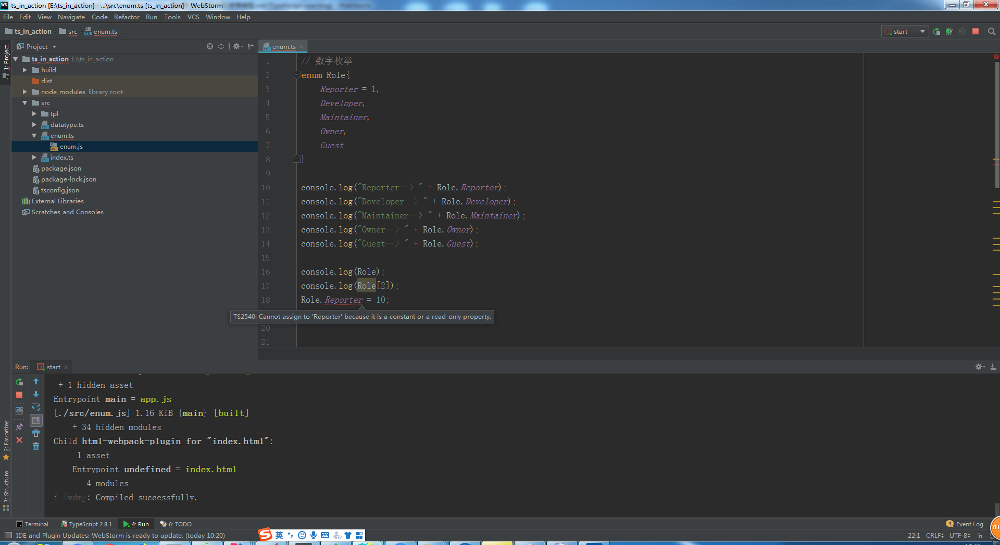

# 枚举类型

> 知识大纲
1. 我们先来看一段代码
    ```
    function initRole(role){
        if(role === 1 || role === 2){
            //do sth
        }else if(role === 3 || role === 4){
            //do sth
        }else if(role == 5){
            //do sth
        }else{
            //do sth
        }
    }
    ```
2. 很明显这段代码的问题有这么几个
    1. 可读性比较差
        * 如果没有对应的文档，根本记不住这些数字代表的是什么角色
    2. 可维护性比较差
        * 硬编码，牵一发动全身
3. 如何解决这个问题，我们就可以使用ts中的枚举类型
4. 枚举是一组有名字的常量集合
    * 你可以把他理解成手机的通讯录
    * 你拨打电话的时候不用记住电话号码，只要记住人名就可以了
    * 况且电话号码是可以变的，人名大多数情况下是不会变的，只要编辑这个人的电话号码就可以了
    
> 练习
1. 我们依旧在我们之前的项目中，src下新建一个enum.ts,然后在index中引用  
2. 数字枚举
    * 具体代码如下
        ```
        // 数字枚举
        enum Role{
            Reporter,
            Developer,
            Maintainer,
            Owner,
            Guest
        }
        
        console.log("Reporter--> " + Role.Reporter);
        ```                   
    * 然后我们就能看到控制台打印了这个  
    
          
        
    * 所以后面的枚举成员，数字就是递增的，就是1，2，3，4...
    * 除此之外我们还可以自定义枚举成员的值  
        ```
        // 数字枚举
        enum Role{
            Reporter = 1,
            Developer,
            Maintainer,
            Owner,
            Guest
        }
        
        console.log("Reporter--> " + Role.Reporter);
        console.log("Developer--> " + Role.Developer);
        console.log("Maintainer--> " + Role.Maintainer);
        console.log("Owner--> " + Role.Owner);
        console.log("Guest--> " + Role.Guest);
        ```  
    * 然后在来看下控制台，说明我们自定义后，枚举成员后面的递增依然有效   
    
         
        
    * 我们发现，枚举很像一个对象，这次我们就直接来打印下Role看下结果  
        * 代码就很简单的一句话`console.log(Role)`  
        * 控制台的结果是
            
            
        
        * 很明显我们可以通过索引来查找，也可以通过定义的枚举成员来查找索引
        * 我们还可以看下是如何实现的，我们来看一下enum.js
            ```
            "use strict";
            // 数字枚举
            var Role;
            (function (Role) {
                Role[Role["Reporter"] = 1] = "Reporter";
                Role[Role["Developer"] = 2] = "Developer";
                Role[Role["Maintainer"] = 3] = "Maintainer";
                Role[Role["Owner"] = 4] = "Owner";
                Role[Role["Guest"] = 5] = "Guest";
            })(Role || (Role = {}));
            console.log("Reporter--> " + Role.Reporter);
            console.log("Developer--> " + Role.Developer);
            console.log("Maintainer--> " + Role.Maintainer);
            console.log("Owner--> " + Role.Owner);
            console.log("Guest--> " + Role.Guest);
            console.log(Role);
            console.log(Role[2]);
            ```
        * `Role["Reporter"] = 1` 这个就是很明显把**Reporter**当成key，value为1，同时这个表达式返回的结果就是1
        * 所以`Role[Role["Reporter"] = 1] = "Reporter";` 又可以把索引当成key，所以能通过数字找到对应的**Reporter**
        * 所以结果就是
            1. 我们可以通过**Role["Reporter"]**或者**Role.Reporter**去查找索引，这个结果就是1
            2. 我们也可以通过**Role[1]**，用索引去查找，这个结果就是Reporter
            3. 原理也非常简单，希望各位小伙伴能看懂实现的原理
        * 这个实现的方式应该就是叫反向映射(如果不对希望大佬轻喷，并且纠正~)
    * 枚举的值定义好就不能被更改，是只读类型，我们可以尝试改下试试，然后编辑器就报错了
    
        
        
3. 字符串枚举     
    * 先来简单看下代码
        ```
        //字符串枚举
        enum Message{
            Success = "恭喜你，成功了",
            Fail = "抱歉，失败了"
        }
        ```   
    * 我们这个时候可以继续看下js文件的代码实现
        ```
        //字符串枚举
        var Message;
        (function (Message) {
            Message["Success"] = "\u606D\u559C\u4F60\uFF0C\u6210\u529F\u4E86";
            Message["Fail"] = "\u62B1\u6B49\uFF0C\u5931\u8D25\u4E86";
        })(Message || (Message = {}));
        ```    
    * 和数字枚举明显是有区别的，这里明显就是不能反向映射，我们只能通过定义的
        Success和Fail去访问对应的message信息，而不能通过信息去获取成功还是失败    
 
4. 异构枚举
    * 这个枚举就是数字枚举和字符串枚举混用
    * 具体代码如下
        ```
        //异构枚举
        enum Answer{
            N,
            Y = "Yes"
        }
        ```
    * 容易引起混淆，所以不建议使用   
    
5. 枚举成员
    * 我们来看下枚举成员的性质
    * 先上代码
        ```
        //枚举成员
        enum Char{
            a,
            b = Char.a,
            c = 1 + 3,
            d = Math.random(),
            e = '123'.length
        }     
        ``` 
    * 枚举成员的类型分为2类
        1. const
            1. 没有初始值的情况 - 对应的就是上述代码的a
            2. 对已有枚举成员的引用 - 对应的就是上述代码的b
            3. 一些常量的表达式 - 对应的就是上述代码的c      
        2. computed
            * 在运行时环境才会被计算
    * 上述的2类，我们可以通过js文件实现就能看出区别 
        * 来看看实现
            ```
            //枚举成员
            var Char;
            (function (Char) {
                Char[Char["a"] = 0] = "a";
                Char[Char["b"] = 0] = "b";
                Char[Char["c"] = 4] = "c";
                Char[Char["d"] = Math.random()] = "d";
                Char[Char["e"] = '123'.length] = "e";
            })(Char || (Char = {}));
            ```               
        * 很明显，a,b,c的结果已经计算出来了，而d，e还没有计算出结果  

6. 常量枚举
    * const声明的枚举就是个常量枚举
    * 具体代码如下
        ```
        //常量枚举
        const enum Month{
            Jan,
            Feb,
            Mar
        }
        ```          
    * 常量枚举有个特性，就是在编译阶段会被移除，我们可以去看下编译后的js文件，并没有我们的常量枚举
    * 常量枚举的作用是什么
        * 当我们不需要一个对象，而需要对象的值的时候，就可以使用常量枚举，这样可以减少我们在编译环境的代码
        * 比如这样一个例子`let month = [Month.Jan, Month.Feb, Month.Mar];` 
        * 然后我们在编译后的js就可以看到这个`var month = [0 /* Jan */, 1 /* Feb */, 2 /* Mar */];` 
 
7. 枚举类型
    * 枚举类型有这么几种
        1. 没有任何初始值
        2. 所有成员都是数字枚举
        3. 所有成员都是字符串枚举    
        
    * 具体代码如下
        ```
        enum E {a, b}
        
        enum F {a = 1, b = 2}
        
        enum G {a = 'apple', b = "banana"}
        ```         
    
    * 接下来我们写这么几行代码加深理解  
        ```
        // 我们可以把任意的number类型赋值给枚举类型，取值也可以超出枚举成员的定义
        let e: E = 3;
        let f: F = 3;
        // e == f; 这里会报错，两种不同类型的枚举是不可以比较的
        
        let e1: E.a = 1;
        let e2: E.b = 2;
        let e3: E.a = 1;
        // e1 == e2  这个也是会报错的。因为他们是不同的枚举成员类型
        // e1 == e3; 这个就没问题
        
        let g1: G = G.b; //字符串枚举只能赋值枚举成员
        let g2: G.a = G.a; //这里赋值只能是G.a
        ``` 

> 目录

* [返回目录](../../README.md)        