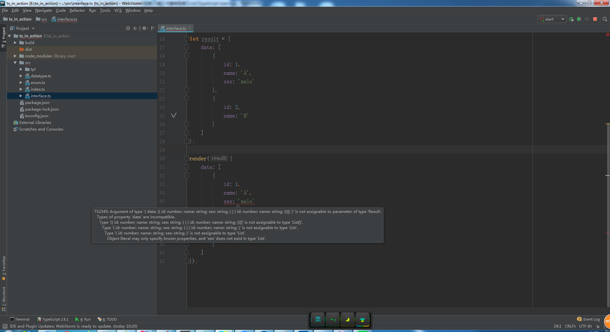
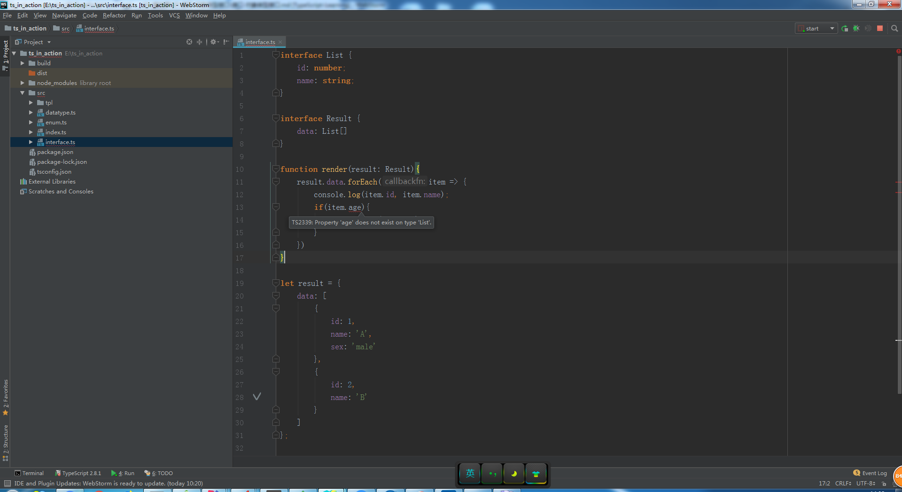
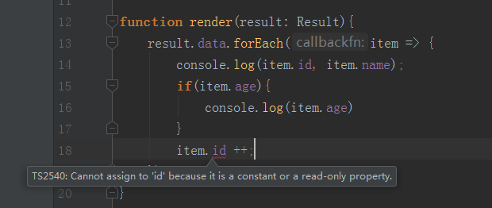

# 接口-对象类型接口

> 知识大纲
1. TypeScript的核心原则之一是对值所具有的结构进行类型检查。
    接口的作用就是为这些类型命名和为你的代码或第三方代码定义契约。
2. 简单的说就是约束对象，函数，类的结构，和类的类型

> 练习
1. 假设我们从后端要获取一组数据，然后渲染到页面之中，我们可以这样定义我们的接口
    1. 代码如下
        ```
        interface List {
            id: number;
            name: string;
        }
        
        interface Result {
            data: List[]
        }
        
        function render(result: Result){
            result.data.forEach(item => {
                console.log(item.id, item.name);
            })
        }
        
        let result = {
            data: [
                {
                    id: 1,
                    name: 'A'
                },
                {
                    id: 2,
                    name: 'B'
                }
            ]
        };
        
        render(result);
        ```
    2. 代码解析    
        * 我们先定义了个接口List，这个是约束我们每个对象的属性，有id和name，id是数字，name是字符串
        * 我们又定义了个接口Result，这个是约束了我们返回的数据结构，是个List数组
        * 然后我们写个渲染的函数，传入的参数就是这个Result结果集，然后遍历它，打印出数组中每个对象的
            id值和name值
        * 我们假设从后端拿到的数据就是下面定义的result的对象，它里面的数据格式是和我们定义的接口Result一致的
        * 最后我们直接调用我们的渲染函数，就能控制台打印出我们想要的结果了 
        
2. 实际开发过程中，根据业务，后端可能会增加字段，比如说每个对象多了个属性叫sex
    1. 我们尝试修改下后端给到的数据
        ```
        let result = {
            data: [
                {
                    id: 1,
                    name: 'A',
                    sex: 'male'
                },
                {
                    id: 2,
                    name: 'B'
                }
            ]
        };
        ```       
    2. 我们会发现ts并没有报错，是允许这种情况发生的
    3. 如果直接传入字面量，就会有问题，我们把`render(result);`改成这样
        ```
        render({
            data: [
                {
                    id: 1,
                    name: 'A',
                    sex: 'male'
                },
                {
                    id: 2,
                    name: 'B'
                }
            ]
        });
        ```
        
        
        
    4. 解决这个问题有这么几种方式
        1. 把字面量赋值给个变量，就像前面那样使用就没问题
        2. 使用类型断言，原理就是我们告诉编译器，这个字面量的类型就是Result，具体代码如下 
            ```
            render({
                data: [
                    {
                        id: 1,
                        name: 'A',
                        sex: 'male'
                    },
                    {
                        id: 2,
                        name: 'B'
                    }
                ]
            } as Result);
            ```    
        3. 使用字符串索引签名，在List接口中这么写
            ```
            interface List {
                id: number;
                name: string;
                [x: string]: any;
            }
            ```   
            
3. 现在又有个新需求，如果有新的字段就把它打印出来，及其他的约束
    1. 这次我们修改render函数，具体代码如下
        (这个案例需要恢复下现场，删除索引签名，然后render函数调用的时候传变量result)   
        ```
        function render(result: Result){
            result.data.forEach(item => {
                console.log(item.id, item.name);
                if(item.age){
                    console.log(item.age)
                }
            })
        }
        ```    
    2. 因为我们List中没有age属性，所以编译器已经给我们错误提示了   
    
             
        
    3. 那我们就在List接口里添加age属性   
        ```
        interface List {
            id: number;
            name: string;
            // [x: string]: any;
            age: number;
        }
        ```  
    4. 然后我们发现还是会报错，原因是age被强制性要求是必要的属性,我们result里有成员是没有age属性的
    
           
        
    5. 这个时候可以使用可选属性，这样就可以解决上述问题了，只要在变量和冒号之间加个问号，具体代码如下
        ```
        interface List {
            id: number;
            name: string;
            // [x: string]: any;
            age?: number;
        }
        ```    
    6. 只读属性
        * 一般id都是只读属性，所以我们给id属性增加个标识**readonly**，具体代码如下    
            ```
            interface List {
                readonly id: number;
                name: string;
                // [x: string]: any;
                age?: number;
            }
            ```
        * 然后我们在render函数中修改下id试试，答案肯定是不能修改的
            
            
         
4. 以上例子都是确定接口有哪些属性的，如果不确定的，可以使用可索引类型的接口，可以用数字索引或者字符串索引            
    * 数字索引
        1. 具体代码如下 
            ```
            interface StringArray {
                [index: number]: string;
            }
            ```  
        2. 他的含义就是用任意的数字去索引StringArray都会得到个string   
        3. 比如我们定义个字符串数组，具体代码如下  
            ```
            let chars: StringArray = ['A', 'B'];
            ```            
    * 字符串索引
        1. 具体代码如下
            ```
            interface Names {
                [x: string]: string;
                // y: number; 这个是不被允许的，因为用的是字符串索引，所以会报错
                // [z: number]: string  两种索引可以混用，既可以用数字去索引Names，也可以用string去索引Names
            }
            ```       
        2. 这里需要注意，数字类型索引的返回值，一定要是字符串索引返回值的子类型，
            因为js会进行类型转换，number会转化为string，这样就能保持类型的兼容性，具体代码如下
            ```
            interface Names{
                [x: string]: any;
                [y: number]: number;
            }
            ```  

> 目录

* [返回目录](../../README.md)            