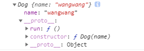
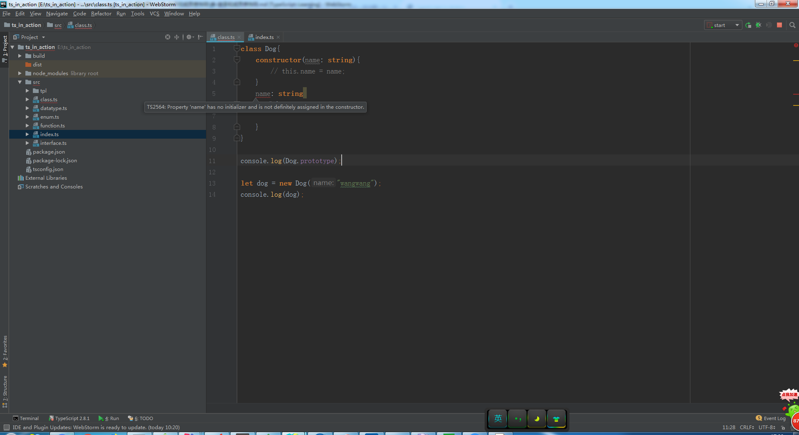

# 类-继承和成员修饰符

> 练习
1. 先用ts写个类，代码如下
    ```
    class Dog{
        constructor(name: string){
            this.name = name;
        }
        name: string
        run(){
            
        }
    }
    ```
    
2. 与es6不同的是，我们为成员属性添加了注解，也为构造函数的参数添加了注解

3. 要注意2个问题，无论在es6还是ts中
    1. 类成员的属性都是实例属性不是原型属性
    2. 在类成员的方法，都是原型上的方法
    
4. 我们打印下类的原型，代码是`console.log(Dog.prototype);`，可以发现是不包含name属性的
    
    
    
5. 我们创建下这个类的实例，并且打印出来，发现name就在实例dog上
    ```
    let dog = new Dog("wangwang");
    console.log(dog);
    ```    
    
    
    
6. 与es6不一样的地方是，实例化必须要给属性初始化，如果不初始化，编辑器会报错
    1. 我们把this.name = name注释掉
    2. 我们能看到报错信息  
    
          
    
    3. 我们也可以把name改成可选的属性，这样也不会报错
    
7. 类的继承
    * 比如说定义个dog的子类哈士奇husky 
        ```
        class Hysky extends Dog{
            constructor(name: string, color: string){
                super(name);
                this.color = color; //this一定要在super之后调用
            }
            color: string
        }
        ``` 
        
8. 修饰符
    * 这是ts对es6的扩展
    * 一共有以下几种
        1. public
            * 这个是默认值，对所有人都是可见的
            * 我们也可以显式的声明，比如
                ```
                class Dog{
                    constructor(name: string){
                        this.name = name;
                    }
                    public name: string;
                    run(){
                
                    }
                }
                ```
                
        2. private 
            * 只能在类的本身被调用，不能被类的实例调用，也不能被子类调用
            * 我们在Dog类里声明个私有方法
                ```
                class Dog{
                    constructor(name: string){
                        this.name = name;
                    }
                    public name: string;
                    run(){
                
                    }
                    private pri(){}
                }
                ```
            * 然后我们在实例上调用，就会报错  
                
                  
     
            * 同理在子类调用，也是会报错的
            * 我们还可以给构造函数constructor前加private，
                这样这个类既不能实例化，也不能被继承
                
        3. protected
            * 只能在类和子类中访问，不能在类的实例中访问
            * 以下代码就没什么问题
                ```
                class Dog{
                    constructor(name: string){
                        this.name = name;
                    }
                    public name: string;
                    run(){
                
                    }
                    private pri(){}
                    protected pro(){}
                }
                
                console.log(Dog.prototype);
                
                let dog = new Dog("wangwang");
                console.log(dog);
                
                // dog.pri(); 报错
                // dog.pro(); 报错
                
                class Hysky extends Dog{
                    constructor(name: string, color: string){
                        super(name);
                        this.color = color; //this一定要在super之后调用
                        // this.pri(); 报错
                        this.pro(); // protected没问题
                    }
                    color: string
                }
                ```
            * 构造函数也能被声明protected，这样这个类不能被实例化，但能被继承，
                相当于是个基类
        
        4. readonly
            * 只读属性,不能更改，这边给狗定义腿的数量，4条腿(正常的狗应该是这样的吧)
                ```
                class Dog{
                    constructor(name: string){
                        this.name = name;
                    }
                    public name: string;
                    run(){
                
                    }
                    private pri(){}
                    protected pro(){}
                    readonly legs: number = 4;
                }
                ```   
            * 只读属性一定要被初始化
          
        5. static
            * 静态成员，只能通过类名来调用
                ```
                class Dog{
                    constructor(name: string){
                        this.name = name;
                    }
                    public name: string;
                    run(){
                
                    }
                    private pri(){}
                    protected pro(){}
                    readonly legs: number = 4;
                    static food: string = "bones";
                }
                console.log(Dog.prototype);
                
                let dog = new Dog("wangwang");
                console.log(dog);
                
                // dog.pri();
                // dog.pro();
                // console.log(dog.food); 这边会报错，因为静态只能用类名去调用
                console.log(Dog.food); //只有这样访问静态成员
                ```    
            * 子类也能继承静态成员     
               
    * 构造函数的参数也能添加修饰符
        * 它的作用是将参数自动变成实例的属性，代码可以更简洁些，比如代码可以这样写 
            ```
            class Hysky extends Dog{
                constructor(name: string, public color: string){
                    super(name);
                    this.color = color; //this一定要在super之后调用
                    // this.pri();
                    this.pro();
                }
                // color: string 因为构造函数参数中写了public color，所以这行代码就不用写了，写了反而会报错
            }
            ```  

> 目录

* [返回目录](../../README.md)                                           
                