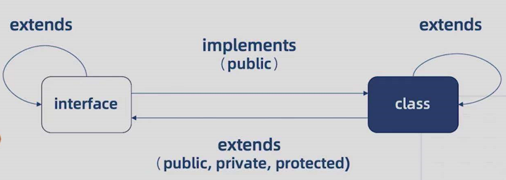

# 类与接口的关系

> 练习
1. 类实现接口
    * 先看这么段代码
        ```
        interface Human {
            name: string;
            eat(): void;
        }
        
        class Asian implements Human{
            constructor(name: string){
                this.name = name;
            }
            name: string;
            eat(){
                
            }
        }
        ```
    * 类实现接口的时候，必须实现接口的所有方法
    * 类可以定义自己的属性
    * 接口只能约束类的公有成员  
    * 接口也不能约束类的构造函数，接口里不能定义构造函数 

2. 接口继承接口    
    * 上代码
        ```
        interface Man extends Human{
            run(): void;
        }
        
        interface Child{
            cry(): void;
        }
        
        interface Boy extends Man, Child{
        
        }
        
        let boy: Boy = {
            name: "",
            eat(){},
            run(){},
            cry(){}
        };
        ```
    * 上面的代码，boy要实现接口里所有的方法，否则就会报错    

3. 接口继承类 
    * 相当于接口把类的成员都抽象出来，只有类的成员结构，没有具体的实现
    * 直接上代码
        ```
        class Auto{
            state = 1
        }
        
        interface AutoInterface extends Auto{
        
        }
        
        class C implements AutoInterface{
            state = 1
        }
        
        class Bus extends Auto implements AutoInterface{
        
        }
        ```    
    * 上面的代码如果**class C**中没有`state = 1`就会报错
    
         
        
4. 总结
    1. 先来看图
        
          
        
    2. 解说
        * 接口之间可以相互继承，这样可以实现接口的复用                
        * 类之间也可以相互继承，可以实现类属性方法的复用
        * 类可以实现接口，接口只能约束类的公有成员
        * 接口可以继承类，即抽离出类的成员结构


> 目录

* [返回目录](../../README.md)        