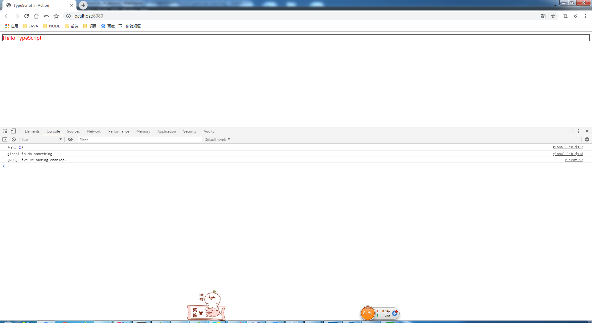

# 如何编写声明文件

> 练习
1. 萌新玩耍
    1. 我们弄个jq来玩玩，输入**npm i jquery**
        * 安装后我们在index.ts中引用jq，`import $ from 'jquery';`
        * 此时发现报错了，是因为ts医用外部库要使用声明文件
    2. 在输入指令**npm i @types/jquery -D**，安装后就发现不报错了
    3. 我们在之前index.ts中，使用jq给原先的文字加上样式
        ```
        import $ from 'jquery';
        
        let hello:string = "Hello TypeScript";
        
        document.querySelectorAll(".app")[0].innerHTML = hello;
        $(".app").css("color", "red").css("border", "1px solid black");
        ```
    4. 这个时候打开页面就发现样式就生效了
    5. 我们在ts中使用外部库的时候首先要考虑有没有声明文件，这边安装的@types/jquery就是声明文件    
    6. 可以[在这个网站](http://microsoft.github.io/TypeSearch/)查询你使用的包有没有声明文件
    7. 如果没有，就需要自己写一个，可以为社区做出贡献，[社区点击这里](http://definitelytyped.org/guides/contributing.html)

2. 学习如何编写声明文件
    1. 一共有三种库    
        1. 全局库
        2. 模块库
        3. umd库
        
    2. 我们在src下新建一个libs文件夹
        1. 新建一个**global-lib.js**,作为全局库
            * 编写js代码 
            
                ```
                function globalLib(options){
                    console.log(options);
                }
                
                globalLib.version = "1.0.0";
                
                globalLib.doSomething = function(){
                    console.log("globalLib do something");
                };
                ```   
            * 我们在index.html中使用引入这个js脚本        
            * 然后在index.ts中调用globalLib方法`globalLib({x: 1});`
            * 此时发现是报错的，是因为我们没有为globalLib写声明文件
            * 我们开始编写全局库的声明文件，新建个**global-lib.d.ts**
            * 代码如下
                ```typescript
                declare function globalLib(options: globalLib.Options): void;
                
                declare namespace globalLib{
                    const version: string;
                    function doSomething(): void;
                    interface Options {
                        [key: string]: any;
                    }
                }
                ```
            * 然后编译错误就消失了~，我们还可以在index.ts中在调用下doSomething的方法
                ```
                globalLib({x: 1});
                globalLib.doSomething();
                ```
            * 这个时候能看到控制台准确的打印出我们预期的效果    
            
                